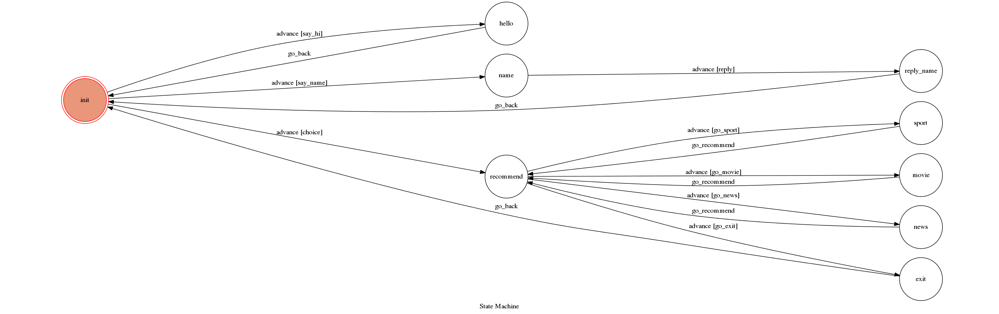

# TOC Project 2017

Template Code for TOC Project 2017

A telegram bot based on a finite state machine

## Step1

cd TOC-Project-2017
cd myenv
source bin/activate
cd ..

## Step2

open a new terminal
do step 1
./ngrok http 5000

After that, `ngrok` would generate a https URL.

You should set `WEBHOOK_URL` (in app.py) to `your-https-URL/hook`.

## Step3

use terminal in step 1
python3 app.py

## Finite State Machine

## Usage
The initial state is set to `init`.

* init
	* Input: "hello"
		* Reply: "Hi!"
        * Go back to state init

	* Input: "name"
		* Reply: "My name is Jibot, an interesting name"
        * Reply: "What's your name?"
        * User reply: "Your name"
        * Reply: "A great name, nice to meet you"
        * Go back to state init

    * Input: "recommend"
        * Reply: "sport,movie,or news"
        * If user reply "sport" or "movie" or "news", Jibot will give user a          website which user wants to find, and then go to recommend state
        * If user reply "exit", go back to state init. And reply: "See you 
          next time"

